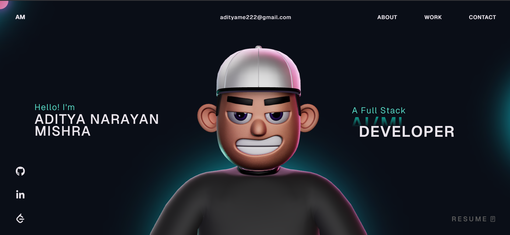

# 💫 Aditya Narayan Mishra — Portfolio

A personal developer portfolio showcasing my projects, skills, and journey as a Full Stack Developer.

---

## 🚀 About

Hi, I'm **Aditya Narayan Mishra**, a B.Tech CSE (AI/ML) student at KIET Group of Institutions, Ghaziabad ('27). I build scalable, high-impact full-stack web applications using modern technologies.

- 🔭 Currently exploring: Advanced Spring Boot, AI/ML integration in web apps
- 🧠 500+ DSA problems solved on LeetCode & CodeChef
- 📫 Open to internships in Full Stack, Software Engineering & AI-driven products

---

## 🛠️ Tech Stack

**Backend**
- Java, Spring Boot, REST APIs, MySQL

**Frontend**
- React.js, JavaScript, Tailwind CSS, HTML5, CSS3

**Others**
- C++, Python, TypeScript, Node.js, Express.js, Next.js
- AWS, Adobe Figma, Git, Nodemon

---

## ✨ Features

- Responsive design across all devices
- Project showcase with live demo and GitHub links
- Skills section with tech stack overview
- About Me section with background and experience
- Contact section with social links (GitHub, LinkedIn, LeetCode)

---

## 📂 Project Structure

```
portfolio/
├── public/
├── src/
│   ├── assets/
│   ├── components/
│   ├── sections/
│   └── App.jsx / main.jsx
├── index.html
├── package.json
└── README.md
```

---

## ⚙️ Getting Started

### Prerequisites

- Node.js >= 18
- npm or yarn

### Installation

```bash
# Clone the repository
git clone https://github.com/adityamishra30/portfolio.git

# Navigate into the directory
cd portfolio

# Install dependencies
npm install

# Start the development server
npm run dev
```

Open [http://localhost:5173](http://localhost:5173) in your browser.

### Build for Production

```bash
npm run build
```

---

## 🌐 Live Demo

> Add your deployed link here (Vercel / Netlify / GitHub Pages)

---

## 🔗 Connect With Me

[](https://github.com/adityamishra30)
[](https://www.linkedin.com/in/aditya-mishra-82384b298/)
[](https://leetcode.com/u/_adityamishra/)

---

---

> Designed & built by Aditya Narayan Mishra
